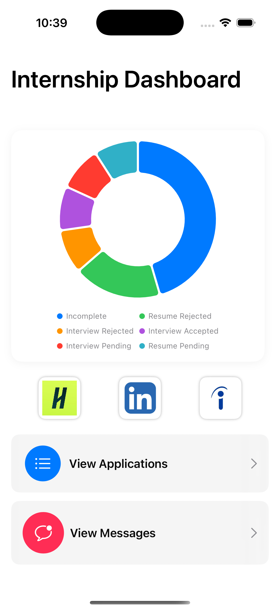
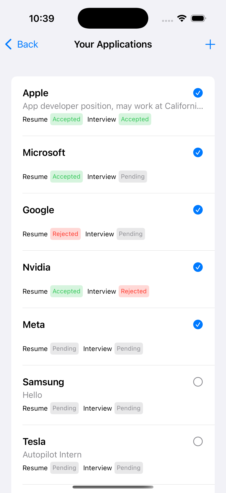
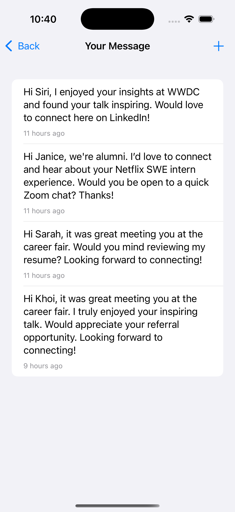
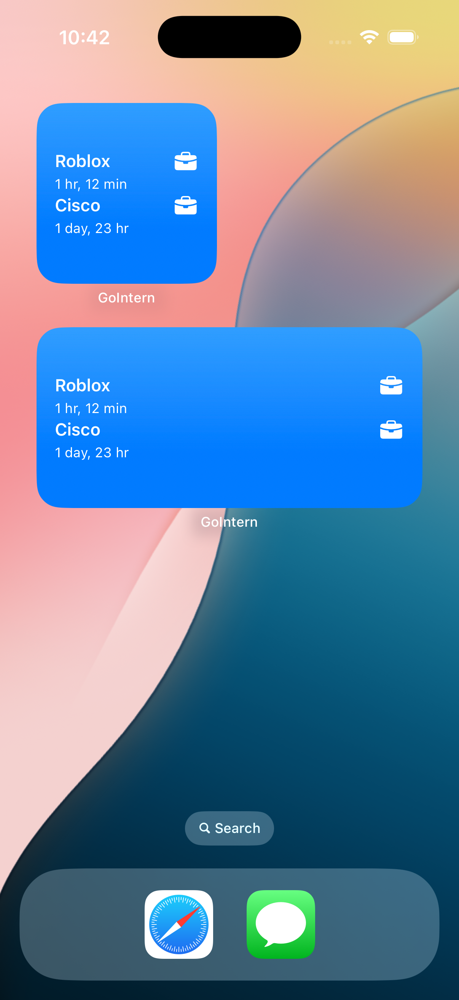

# 📌 GoIntern

GoIntern is a Swift-based iOS app designed to help students and job seekers seamlessly **track internship applications** and **generate customized LinkedIn messages** all in one place.

## 📱 Screenshots

### 🔹 Home Dashboard

### 🔹 Application Tracker

### 🔹 Message Generator

### 🔹 Widget

## ✨ Features

- ✅ **Internship Application Management**  
  Add and manage applications, track resume and interview status, and visualize progress with interactive **pie charts**

- 💬 **LinkedIn Message Generator**  
  Create personalized LinkedIn messages using the **GPT-4.1 nano model via OpenAI API**

- 📅 **iOS Home Screen Widget**  
  View up to **three upcoming incomplete applications** sorted by the closest deadline

## 🛠️ Built With

- **SwiftUI** – Declarative UI framework for building a smooth user interface.  
- **SwiftData** – For local data persistence of applications and messages.  
- **WidgetKit** – To create a home screen widget that displays upcoming application deadlines in real time
- **OpenAI API (GPT-4.1 nano)** – To generate personalized LinkedIn messages based on user input

## 🎬 Demo
https://youtu.be/p8p4fCsPMaw 

